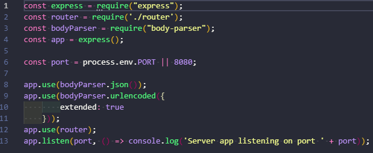
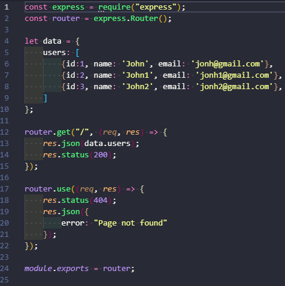
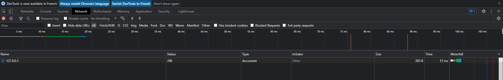
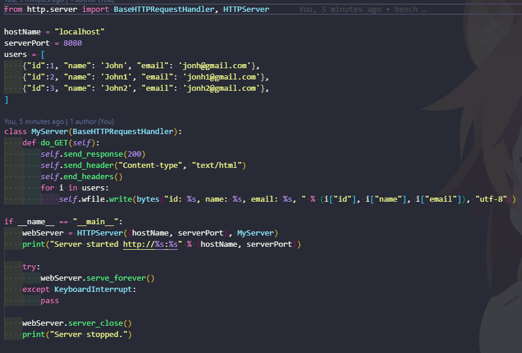
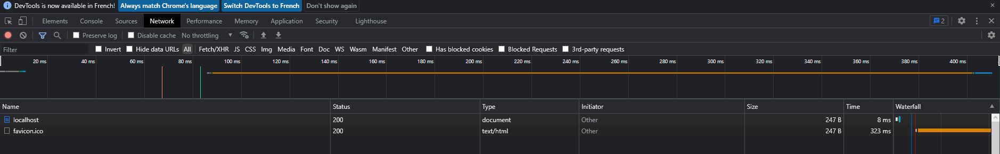

# NODEJS
NodeJs nous permet de réaliser un serveur avec un temps de réponses relativement bas, 31ms de manière simple et ergonomique.

## Code
### Server.js

À l'aide de ce simple code nous pouvons créer un serveur capable de recevoir des requêtes.
### Router.js

En voyant ce code nous venons à la conclusion qu'il est basique, il nous permet de traiter les différentes routes que le serveur aura et à afficher les informations sous forme de jsons.

## Stats

# Python
Le python est un language permettant une interprétation des requêtes plus simple que le js cependant le code est également plus complexe.

## Code

Nous pouvons constater que ce code, malgré la longueur, est plus complexe que le NodeJs, il doit comprendre une classe héritée et ne fait que gérer la branche principale, l'impression des données est également plus complexe avec l'ajout d'un "for" et d'un "print" (le "print" devrait être balisé comme en html afin de générer correctement la page).

## Stats

# Avis Final
Après avoir pu effectuer des recherches sur les différents languages ainsi que des tests réalisés en C, CPP et Ruby (non présent car incapacité à les réaliser) et en NodeJs et python, nous avons pu déterminer que le NodeJs est le language qui allie simplicité et efficacité de la meilleure des manières pour nous. De plus, la documentation du NodeJs, et de ses librairies, nous paraît bien plus compréhensible que ce que nous avons pu voir sur le python.

# Liens de références

- https://github.com/kostya/benchmarks
- https://blog.back4app.com/best-backend-language/
- https://deepu.tech/concurrency-in-modern-languages-final/
- https://yalantis.com/blog/golang-vs-nodejs-comparison/
- https://djangostars.com/blog/my-story-with-golang/
- https://mobiskill.fr/blog/conseils-emploi-tech/developpement-backend-quel-language-utiliser/
