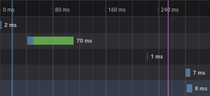

# React
## Code

[Go to code](https://github.com/EpitechPromo2025/B-DEV-500-MPL-5-2-area-ilia.schastnev/blob/main/server/benchFront/React/test/src/App.js)

## Bench

Comme nous pouvons le constater toute les ressources sont charger de manière très rapide.

## Temp de réalisation
Ce petit bout de code auras pris 2h pour être créer. Il y a de nombreuses documentations qui nous ont permises de réaliser la todo-list rapidement.

## Est-il viable ?
De mon point de vue, ce framework est viable puisqu'il est rapide, documenté et compréhensible de tous.