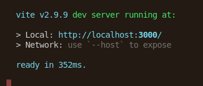
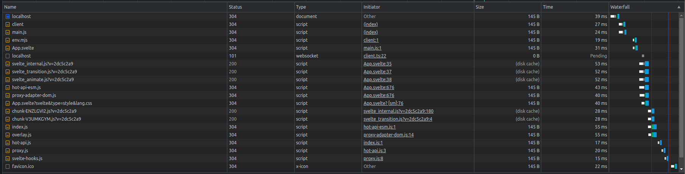

# Svelt
## Code

[Go to code](https://github.com/EpitechPromo2025/B-DEV-500-MPL-5-2-area-ilia.schastnev/blob/main/server/benchFront/svelt/my-app/src/App.svelte)

## Bench

Le temps de compilation est correct bien que légérement long.

Comme nous pouvons le constater toute les ressources sont charger de manière rapide et éfficace.

## Temp de réalisation
Ce petit bout de code auras pris 4h pour être créer. Il a demander beaucoup de recherches et n'ai a mon sens pas très compréhensible.

## Est-il viable ?
Au vu de la difficulté que j'ai éprouver lors de la réalisation de cette todo-list, ce framework pourrait être utiliser cependant il ne serait pas le plus pratique.