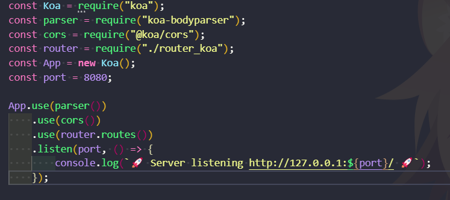
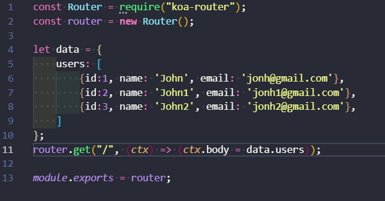
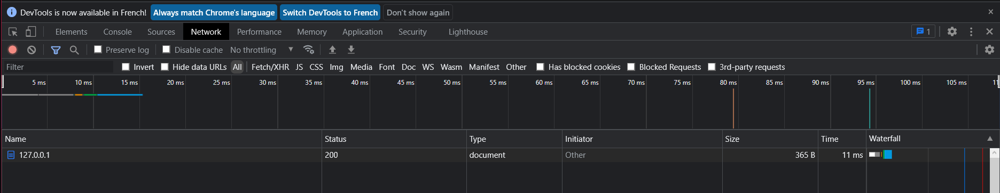
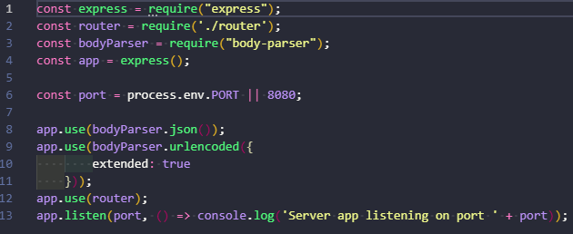
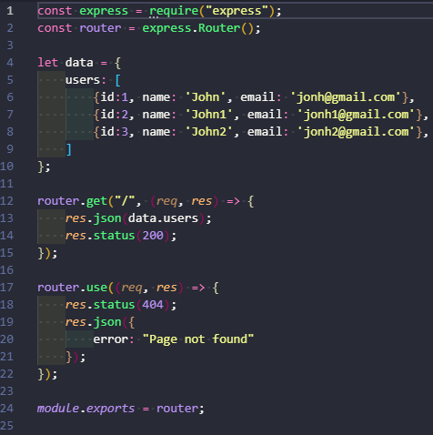
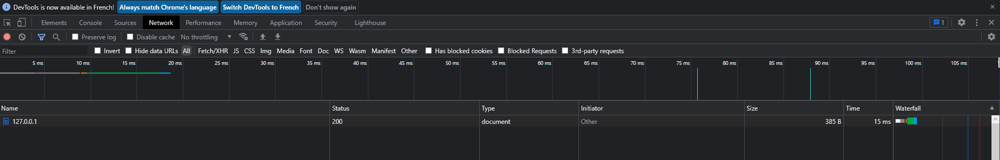

# KOA
KOA est un framework nodejs permettant de réaliser des apps optimisés.

## Code
### serv_koa.js

Ce code nous permet de lancer un serveur de manière relativement simple.
### router_koa.js

Et cette seconde partie de code permet de définir les routes de notre serveur.

## Stats

Comme nous pouvons le constater le temps de réponse des requêtes est bas et le code est relativement simple.

# ExpressJs
ExpressJs est un framework fullstack, il est l'un des plus utilisé dû à sa capacité à traiter divers aspect du développement back-end, mais aussi front-end de manière simple et optimisé.

## Code
### serv.js

Dans ce code nous démarrons un serveur permettant d'utiliser des routes.
### router.js

Ce code permet de définir les routes permettant l'accès au différentes pages reliées au serveur.

## Stats

Comme nous pouvons le constater, le temps de réponse est relativement élevé.

# Avis Final
Après différents tests de framework seul 2 ont retenu notre attention : KOA et ExpressJs. Ces deux frameworkS ont retenu notre attention d'une part pour leur doccumentation fournie mais aussi pour leur efficacité et pour leur simplicité. Cependant, nous avons choisi d'utiliser ExpressJs car ce framework nous parrait plus simple à compprendre et mettre en place.
